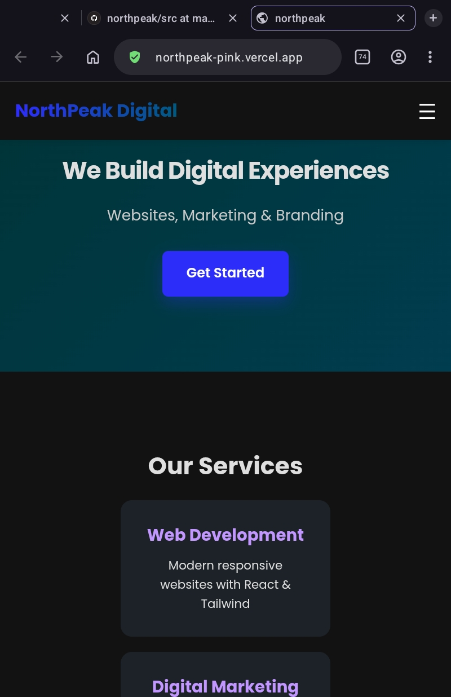

# React + Vite

This template provides a minimal setup to get React working in Vite with HMR and some ESLint rules.

Currently, two official plugins are available:

- [@vitejs/plugin-react](https://github.com/vitejs/vite-plugin-react/blob/main/packages/plugin-react) uses [Oxc](https://oxc.rs)
- [@vitejs/plugin-react-swc](https://github.com/vitejs/vite-plugin-react/blob/main/packages/plugin-react-swc) uses [SWC](https://swc.rs/)

## React Compiler

The React Compiler is enabled on this template. See [this documentation](https://react.dev/learn/react-compiler) for more information.

Note: This will impact Vite dev & build performances.

## Expanding the ESLint configuration

If you are developing a production application, we recommend using TypeScript with type-aware lint rules enabled. Check out the [TS template](https://github.com/vitejs/vite/tree/main/packages/create-vite/template-react-ts) for information on how to integrate TypeScript and [`typescript-eslint`](https://typescript-eslint.io) in your project.


# NorthPeak 🚀

**We Build Digital Experiences**

**🌐 Live Demo:** https://northpeak-pink.vercel.app/
**📂 GitHub Repo:** https://github.com/mauryakavita/northpeak

---

### About
NorthPeak ek modern aur responsive web agency website hai. Iska goal hai brands ko digital duniya me ek strong presence dena. Clean UI, fast performance aur smooth animations ke saath banayi gayi hai.

### ✨ Key Features
- **Responsive Design** - Mobile, Tablet, Desktop sab me perfect
- **Modern UI/UX** - Clean layout aur professional look
- **Fast Performance** - Vite + React ke saath lightning speed
- **Smooth Animations** - User experience ko next level
- **SEO Optimized** - Better visibility ke liye
- **Deployed on Vercel** - Auto CI/CD with GitHub

### 🛠️ Tech Stack
| Category | Technology |
| --- | --- |
| **Frontend** | React, Vite, JavaScript, JSX |
| **Styling** | Tailwind CSS / CSS3 |
| **Icons** | React Icons / Lucide |
| **Deployment** | Vercel |
| **Version Control** | Git, GitHub |


### 📸 Preview




**Live Demo:** https://northpeak-pink.vercel.app/

### 🚀 Getting Started

1. **Clone the repository**
```bash
git clone https://github.com/mauryakavita/northpeak.git


